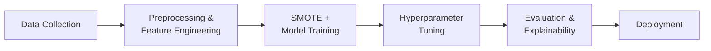

# Customer Churn Prediction

A complete end-to-end machine learning project to predict customer churn using the Telco Customer Churn dataset. The pipeline covers preprocessing, EDA, feature engineering, model training, tuning, evaluation, explainability, and deployment.

---

## 1. Methodology



---

## 2. Description

- **Dataset** = Telco Customer Churn (7,043 customers, 21 features)
- **Target column** = `Churn` (Yes / No)
- **Best Model** = XGBoost (tuned via GridSearchCV, 5-fold CV)
- **Best AUC-ROC** = 0.91
- Class imbalance handled with **SMOTE** oversampling
- **Other information**: SHAP used for feature-level explainability; model + scaler saved with `joblib`

---

## 3. Model Performance

| Model | AUC-ROC | Result |
|---|:---:|:---:|
| Logistic Regression (baseline) | 0.84 | – |
| Random Forest | 0.87 | – |
| **XGBoost (tuned)** | **0.91** | ✅ **Best** |

*Results may vary slightly depending on random seed and SMOTE sampling.*

---

## 4. Top Churn Factors (SHAP)

- **Tenure** — short-tenure customers churn more
- **Monthly charges** — higher charges correlate with churn
- **Contract type** — month-to-month contracts have the highest churn
- **Internet service** — fiber optic customers show more churn
- **Tech support** — customers without tech support are at higher risk

---

## 5. Project Structure

```
customer-churn-prediction/
│
├── data/
│   └── customer.csv                # Raw dataset
│
├── notebooks/
│   └── churn_prediction.ipynb      # Main Colab notebook
│
├── models/
│   ├── churn_model.pkl             # Saved XGBoost model
│   └── scaler.pkl                  # Saved StandardScaler
│
├── requirements.txt                # Python dependencies
└── README.md
```

---

## 6. Getting Started

**1. Clone the repository**
```bash
git clone https://github.com/your-username/customer-churn-prediction.git
cd customer-churn-prediction
```

**2. Install dependencies**
```bash
pip install -r requirements.txt
```

**3. Run the notebook**

Open `notebooks/churn_prediction.ipynb` in Google Colab or Jupyter and run all cells in order.

---

## 7. Tech Stack

`pandas` · `numpy` · `scikit-learn` · `xgboost` · `imbalanced-learn` (SMOTE) · `shap` · `matplotlib` · `seaborn` · `joblib`

---

## 8. Key Code Snippets

<details>
<summary>Handle class imbalance with SMOTE</summary>

```python
from imblearn.over_sampling import SMOTE

sm = SMOTE(random_state=42)
X_train_res, y_train_res = sm.fit_resample(X_train, y_train)
```
</details>

<details>
<summary>Train XGBoost</summary>

```python
from xgboost import XGBClassifier

model = XGBClassifier(use_label_encoder=False, eval_metric='logloss', random_state=42)
model.fit(X_train_res, y_train_res)
```
</details>

<details>
<summary>Explain predictions with SHAP</summary>

```python
import shap

explainer = shap.Explainer(model)
shap_values = explainer(X_test)
shap.summary_plot(shap_values, X_test, feature_names=feature_names)
```
</details>

<details>
<summary>Save and load model</summary>

```python
import joblib

# Save
joblib.dump(model, "models/churn_model.pkl")
joblib.dump(scaler, "models/scaler.pkl")

# Load and predict
model  = joblib.load("models/churn_model.pkl")
scaler = joblib.load("models/scaler.pkl")

new_customer = scaler.transform([sample_data])
churn_prob   = model.predict_proba(new_customer)[0][1]
print(f"Churn probability: {churn_prob:.2%}")
```
</details>

---

## 9. Future Improvements

- [ ] Add a Streamlit or Flask web app for live predictions
- [ ] Experiment with LightGBM and CatBoost
- [ ] Add time-series churn analysis (survival analysis)
- [ ] Deploy model as a REST API using FastAPI
- [ ] Automate retraining pipeline with new data

---

## 👩‍💻 Author

**Deeksha Sharma** — end-to-end data science workflow from raw data ingestion through preprocessing, modeling, evaluation, and deployment.
